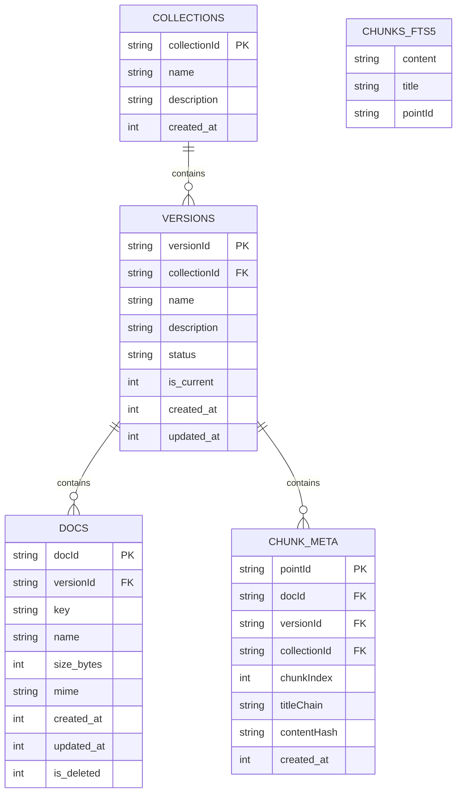
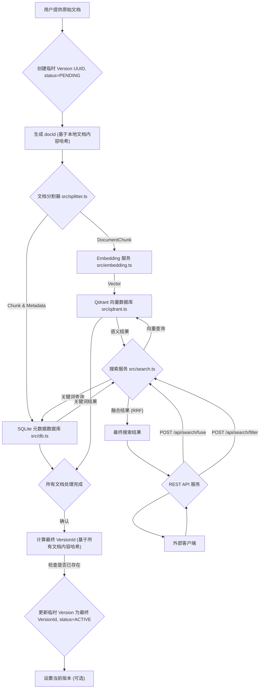

# 系统架构概述

## 1. 总体架构目标与核心组件

本项目旨在构建一个基于 Qdrant 和 SQLite 的 RAG（检索增强生成）系统，用于文档的智能检索。其核心目标是提供高效、准确的文档检索能力，并支持灵活的文档管理和版本控制。

核心架构组件包括：

- **REST API 服务**: 对外提供统一的 API 接口，处理外部客户端的请求，包括混合查询和条件查询。
- **文档加载与分割 (`src/loader.ts`, `src/splitter.ts`)**: 负责从各种来源加载原始文档，并根据预设策略将其分割成语义连贯的文本块（chunks），同时保留上下文元数据。
- **向量化服务 (`src/embedding.ts`)**: 封装了 OpenAI 兼容的 API，用于将文本块转换为高维向量，为语义搜索提供基础。
- **Qdrant 向量数据库 (`src/qdrant.ts`)**: 存储文本块的向量表示及其关键元数据，支持高效的向量相似度搜索。
- **SQLite 元数据数据库 (`src/db.ts`)**: 作为核心元数据存储，管理文档、版本、块的结构化信息，并提供 FTS5 全文索引以支持关键词搜索。
- **搜索服务 (`src/search.ts`)**: 实现了混合搜索功能，结合关键词搜索和语义搜索，并通过 RRF 算法融合结果，提供全面准确的检索能力。
- **配置管理 (`config.ts`)**: 集中管理系统运行所需的各项配置参数。

## 2. 核心概念与实体关系

系统围绕 **Collection → Version → Doc → Chunk** 的层次结构组织数据，并通过统一的 ID 方案进行关联。

## 3. 文档处理流程

文档从用户提供到最终入库的完整流程如下：

**流程详解：**

1.  **用户提供原始文档**: 外部系统或用户上传原始文档。
2.  **创建临时 Version 容器**: 系统在 SQLite 中创建一个临时的 `Version` 记录，赋予一个 UUID 作为 `versionId`，状态为 `PENDING`。此 `versionId` 用于在处理过程中关联属于同一批次的文档。
3.  **生成 `docId`**: 在本地处理文档内容之前，计算文档内容的 SHA256 哈希值，作为该文档的 `docId`。此 `docId` 唯一标识一个逻辑文档。
4.  **文档分割 (`src/splitter.ts`)**: 文档内容被 `splitter` 模块分割成多个 `DocumentChunk`。每个 `chunk` 包含内容和 `titleChain` 等元数据。
5.  **向量化 (`src/embedding.ts`)**: `embedding` 模块将每个 `DocumentChunk` 的内容转换为高维向量。
6.  **数据入库 (Qdrant & SQLite)**:
    - 为每个 `DocumentChunk` 生成 `pointId = docId#chunkIndex`。
    - 将 `CHUNK_META`（包含 `pointId`, `docId`, `versionId`, `collectionId`, `chunkIndex`, `titleChain`, `contentHash` 等）和 `CHUNKS_FTS5`（包含 `content`, `title`, `pointId`）数据插入 SQLite。
    - 将向量数据和 `payload`（包含 `content`, `titleChain`, `docId`, `versionId`, `chunkIndex`, `collectionId` 等关键元数据）插入 Qdrant。
7.  **计算最终 `VersionId` 并更新**: 当批次中所有文档都处理完成并成功入库后，系统计算所有文档内容的组合哈希值，生成最终的 `VersionId`。
    - **去重逻辑**: 查询数据库，如果已存在具有相同最终 `VersionId` 的版本，则放弃当前临时版本，并将当前批次中已入库的 `doc` 和 `chunk` 记录重新关联到已存在的 `VersionId`。
    - 如果不存在，则更新临时 `Version` 记录的 `versionId` 为最终哈希值，并将 `status` 更新为 `ACTIVE`。
8.  **设置当前版本 (可选)**: 可以通过一个单独的操作将某个 `Version` 标记为 `is_current`，作为 Collection 的默认检索版本。

## 4. 模块职责与功能分析

### 4.1 REST API 服务

- **职责**: 作为系统的对外接口，接收和响应外部客户端的请求。
- **主要功能**:
  - 提供搜索接口（混合查询、条件查询）。
  - 处理请求参数的验证和解析。
  - 调用内部搜索服务，并将结果格式化后返回。
  - 提供搜索接口（混合查询、条件查询）。
  - 提供文档（Document）的 CRUD 接口。
  - 提供 Collection 和 Version 的 CRUD 接口。
  - 处理请求参数的验证和解析。
  - 调用内部搜索服务，并将结果格式化后返回。
  - 未来可引入其他模块或服务来提供实际面向用户的管理 `Collection-Version-Doc-Chunk` 这些实体的功能，并可考虑使用 React 等前端框架开发 Web UI。

### 4.2 文档加载器 (`src/loader.ts`)

- **职责**: 从指定来源加载原始文档内容。
- **主要功能**:
  - 读取文件系统中的文档。
  - 目前功能仅限于读取文件系统中的文档。
  - 未来可扩展支持从数据库或其他外部源加载文档，或引入其他模块来提供更强大的文档管理功能。

### 4.3 文档分割器 (`src/splitter.ts`)

- **职责**: 将原始文档内容分割成更小、更易于处理的文本块（chunks），并提取相关元数据。
- **主要功能**:
  - 支持多种分割策略：按 Markdown 标题、固定大小（带重叠）、按句子。
  - 在分割过程中保留 `titleChain` 等上下文信息，并将其附加到每个 `DocumentChunk`。
  - 确保分割后的块具有语义连贯性。

### 4.4 向量化服务 (`src/embedding.ts`)

- **职责**: 将文本内容转换为高维向量（embeddings）。
- **主要功能**:
  - 封装 OpenAI 兼容的 Embedding API 调用。
  - 支持通过环境变量配置不同的 Embedding 服务提供商。
  - 处理批量文本的向量化请求。

### 4.5 Qdrant 向量数据库 (`src/qdrant.ts`)

- **职责**: 存储和管理文本块的向量表示，并支持高效的向量相似度搜索。
- **主要功能**:
  - 确保 Qdrant Collection 的存在和正确配置（`ensureCollection`）。
  - 批量插入（upsert）向量数据和 `payload`（包含 `pointId`, `content`, `titleChain` 等元数据）。
  - 执行向量相似度搜索。
  - 支持 `payload` 过滤，以实现条件查询。

### 4.6 SQLite 元数据数据库 (`src/db.ts`)

- **职责**: 存储和管理所有结构化元数据（Collection, Version, Doc, Chunk_Meta）和完整的文本内容（Chunks_FTS5），并提供关键词搜索能力。
- **主要功能**:
  - 管理 Collection、Version、Doc、Chunk_Meta 的 CRUD 操作。
  - 提供 FTS5 全文索引，支持高效的关键词搜索。
  - 实现 `getChunksByPointIds` 等回表查询，根据 `pointId` 获取完整的 Chunk 信息。
  - 提供统一的事务包装器 (`transaction`)，确保数据操作的原子性。
  - 支持 `is_current` 版本标记和软删除。

### 4.7 搜索服务 (`src/search.ts`)

- **职责**: 协调关键词搜索和语义搜索，融合结果，并应用条件过滤。
- **主要功能**:
  - 接收用户查询和过滤条件。
  - 并行调用 `db.searchKeyword` (FTS5) 进行关键词搜索。
  - 调用 `embedding` 服务将查询向量化，然后调用 `qdrant.search` 进行语义搜索。
  - 使用 RRF (Reciprocal Rank Fusion) 算法融合关键词和语义搜索结果。
  - 应用额外的过滤条件（例如，根据 `docId`, `versionId`, `collectionId` 或其他元数据）来精炼搜索结果。
  - 将最终的 `UnifiedSearchResult` 返回给 REST API 服务。

### 4.8 配置管理 (`config.ts`)

- **职责**: 集中管理系统运行所需的各项配置参数。
- **主要功能**:
  - 定义 Qdrant 集合名称、向量维度等关键参数。
  - 管理 OpenAI API 相关的环境变量。
  - **OPENAI API 配置**: 包括 `OPENAI_BASE_URL` (兼容 OpenAI API 的服务地址) 和 `OPENAI_API_KEY`。
  - **SQLite 数据库路径**: 数据库文件的存储路径，在 `src/db.ts` 实例化时传入。
  - **Qdrant 配置**: 包括 `QDRANT_URL` (Qdrant 服务地址，对应 `config.ts` 中的 `qdrant.host` 和 `qdrant.port`)。
  - **配置解析逻辑**: 目前 `config.ts` 的配置解析逻辑尚未完全调整，需要考虑到这一点。

## 5. 搜索机制

本项目采用双通道混合搜索机制，结合了关键词搜索和语义搜索的优势，并通过 RRF 算法进行结果融合。

- **关键词搜索 (FTS5)**: 利用 SQLite 的 FTS5 扩展，对 `CHUNKS_FTS5` 表中的 `content` 和 `title` 字段进行全文检索，快速匹配包含查询关键词的文本块。
- **语义搜索 (Qdrant)**: 将用户查询向量化后，在 Qdrant 向量数据库中进行向量相似度搜索，查找与查询语义最相关的文本块。Qdrant 的 `payload` 过滤机制可用于在向量搜索阶段应用条件过滤。
- **RRF (Reciprocal Rank Fusion) 融合**: 将关键词搜索和语义搜索的结果列表进行融合。RRF 算法根据每个结果在各自列表中的排名，计算一个融合分数，从而对结果进行重新排序，提供更全面和准确的检索结果。
- **条件查询**: 搜索服务将支持接收额外的过滤参数。这些参数可以在关键词搜索的 SQL 查询中作为 `WHERE` 子句应用，也可以在语义搜索的 Qdrant `payload` 过滤中应用，以过滤掉不符合特定条件的“无用数据”。

## 6. ID 生成与管理策略

系统采用统一的 ID 方案来确保数据的一致性和可追溯性。

- **`collectionId`**: 在创建 Collection 时生成，作为 Collection 的唯一标识符。
- **`docId`**: 在本地处理文档内容之前，计算文档内容的 SHA256 哈希值，作为该文档的 `docId`。这确保了 `docId` 与文档内容关联，并具有唯一性。
- **`versionId`**:
  - **临时生成**: 在开始处理一批文档时，生成一个临时的 UUID 作为 `versionId`，用于在处理过程中关联文档。
  - **最终生成与去重**: 当批次中所有文档处理完成并成功入库后，计算所有文档内容的组合哈希值，作为最终的 `versionId`。如果该 `versionId` 已存在，则放弃当前临时版本，将已入库的 `doc` 和 `chunk` 重新关联到现有版本，实现内容去重。
- **`pointId`**: `docId#chunkIndex` 的组合，作为每个文本块的唯一标识符，用于关联 SQLite 中的 `CHUNK_META` 和 `CHUNKS_FTS5`，以及 Qdrant 中的向量。

## 7. REST API 接口设计

本项目提供了以下 REST API 接口，涵盖了文档的搜索、Collection、Version 和 Document 的管理功能。

### 7.1 搜索接口

- **`POST /api/search`**:
  - **请求体**: `{ query: string, collectionId: string, limit?: number, filters?: { [key: string]: any }, latestOnly?: boolean }`
  - **功能**: 执行混合搜索（关键词 + 语义），应用 `filters` 进行条件查询，并通过 RRF 算法融合结果。`latestOnly` 参数用于指定是否只搜索当前 Collection 的最新版本文档。
  - **响应体**: `UnifiedSearchResult[]` (包含 `pointId, content, title?, score, versionId, docId, chunkIndex, is_current?`)

### 7.2 Collection 管理接口

- **`POST /api/collections`**:
  - **请求体**: `{ name: string, description?: string }`
  - **功能**: 创建一个新的 Collection。
  - **响应体**: `Collection` 对象。
- **`GET /api/collections`**:
  - **功能**: 获取所有 Collection。
  - **响应体**: `Collection[]` 数组。
- **`GET /api/collections/:collectionId`**:
  - **功能**: 根据 `collectionId` 获取单个 Collection。
  - **响应体**: `Collection` 对象。
- **`DELETE /api/collections/:collectionId`**:
  - **功能**: 删除一个 Collection 及其所有关联的版本、文档和文本块。
  - **响应体**: `204 No Content`。

### 7.3 Version 管理接口

- **`POST /api/collections/:collectionId/versions`**:
  - **请求体**: `{ name: string, description?: string }`
  - **功能**: 为指定的 Collection 创建一个新的 Version。
  - **响应体**: `Version` 对象。
- **`GET /api/collections/:collectionId/versions`**:
  - **功能**: 获取指定 Collection 的所有 Version。
  - **响应体**: `Version[]` 数组。
- **`GET /api/versions/:versionId`**:
  - **功能**: 根据 `versionId` 获取单个 Version。
  - **响应体**: `Version` 对象。
- **`PUT /api/versions/:versionId/status`**:
  - **请求体**: `{ status: string }`
  - **功能**: 更新指定 Version 的状态（例如：`EDITING`, `ACTIVE`, `INDEXED_SQLITE`, `INDEXED_QDRANT`, `FAILED`）。
  - **响应体**: 更新后的 `Version` 对象。
- **`POST /api/versions/:versionId/set-current`**:
  - **功能**: 将指定 Version 设置为其所属 Collection 的当前激活版本。
  - **响应体**: 更新后的 `Version` 对象。
- **`POST /api/versions/:versionId/finalize`**:
  - **功能**: 最终确定一个 Version。系统会根据该版本下的所有文档内容生成一个永久的 `versionId`，并处理去重逻辑。
  - **响应体**: `{ finalVersionId: string, isNew: boolean }`。
- **`DELETE /api/versions/:versionId`**:
  - **功能**: 删除一个 Version 及其所有关联的文档和文本块。
  - **响应体**: `204 No Content`。

### 7.4 Document 管理接口

- **`POST /api/docs`**:
  - **请求体**: `{ content: string, collectionId: string, versionId: string, metadata?: { [key: string]: any }, splitOptions?: SplitOptions }`
  - **功能**: 创建一个新文档，并将其分割、向量化、入库。
  - **响应体**: `Doc` 对象。
- **`GET /api/docs`**:
  - **功能**: 获取所有文档。
  - **响应体**: `Doc[]` 数组。
- **`GET /api/docs/:docId`**:
  - **功能**: 根据 `docId` 获取单个文档。
  - **响应体**: `Doc` 对象。
- **`PUT /api/docs/:docId`**:
  - **请求体**: `{ content: string, metadata?: { [key: string]: any }, splitOptions?: SplitOptions }`
  - **功能**: 更新指定文档的内容和元数据。此操作会重新分割、向量化和入库该文档的文本块。
  - **响应体**: 更新后的 `Doc` 对象。
- **`DELETE /api/docs/:docId`**:
  - **功能**: 软删除一个文档及其所有关联的文本块。
  - **响应体**: `204 No Content`。

`filters` 参数将是一个灵活的 JSON 对象，允许客户端根据 `chunk_meta` 或 `doc` 表中的任何元数据字段进行过滤。

## 8. 性能与规模考量

- **数据规模**: 每个 Collection 预计包含约 30 个文档 / 400-500 个文本块（或更长块、数量减少）。
- **SQLite 性能**: SQLite 事务批量写入预计为毫秒级，FTS5 在该规模下检索瞬时。
- **Qdrant 性能**: Qdrant 向量搜索在适当的索引和硬件配置下，性能表现优秀。
- **瓶颈**: 主要瓶颈预计在 Embedding API 的限速，需要实现批量请求和指数退避策略来优化。
- **可扩展性**: 架构设计支持水平扩展 Qdrant 实例，并通过增加 REST API 服务实例来处理高并发请求。SQLite 作为元数据存储，在单机性能达到瓶颈时，可能需要考虑迁移到分布式关系型数据库。
- **SQLite 数据库路径**: 数据库文件的存储路径应可配置，例如通过环境变量或配置文件。
