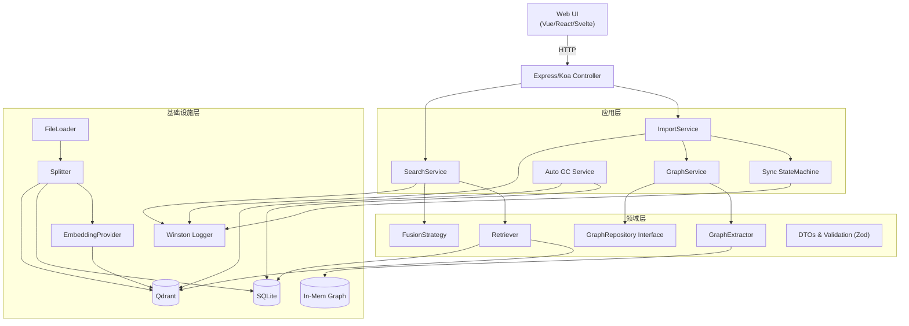
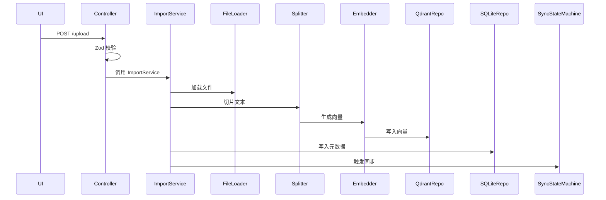
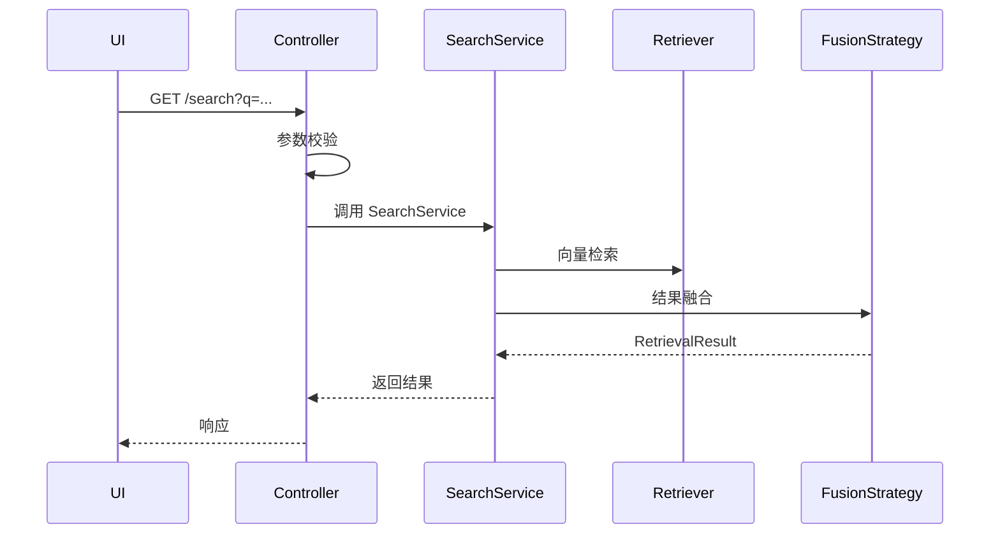
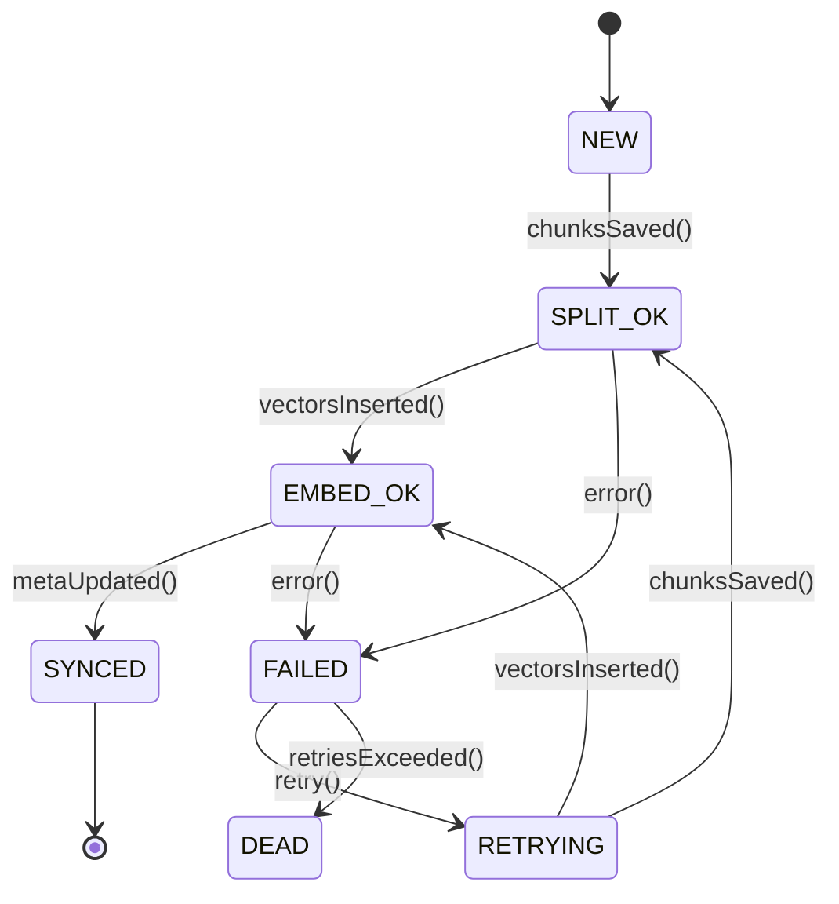

## 目录

1. 项目背景与目标
2. 总体架构概览（Mermaid 图）
3. 领域模型
4. 各分层设计
    4.1 表现层（Web UI）
    4.2 API 层 ⭐
    4.3 应用层
    4.4 领域层（接口 & 策略）
    4.5 基础设施层
5. 关键第三方依赖
6. 运行时流程
7. 日志与监控
8. 向量同步状态机
9. 部署与配置
10. 未来可扩展点

---

## 1. 项目背景与目标

- 构建一个支持 **文档级 RAG 检索**，并预留 **知识图谱** 能力的服务。
- 核心目标：

  - 架构极简，模块清晰；
  - 算法可插拔，便于替换 Embedding、Splitter、Retriever 等组件；
  - 保证向量数据库（Qdrant）与元数据存储（SQLite）的一致性；
  - 提供统一、易用、可自动生成文档的 API 接口。

---

## 2. 总体架构概览



---

## 3. 领域模型

核心领域对象：

- `Collection` → `Doc` → `Chunk`
- `GraphFragment`：包含 `Node` 与 `Edge`
- `RetrievalResult`：联合类型，支持多种检索结果（如 chunkResult、graphResult 等）

---

## 4. 各分层设计

### 4.1 表现层（Web UI）

- 技术栈：Vue / React / Svelte 单页应用（SPA）
- 功能：

  - 调用后端 RESTful 或 GraphQL API
  - 实现身份验证（JWT / Cookie）
  - 支持文件上传、搜索展示、文档管理等交互

---

### 4.2 API 层 ⭐

> **本次重构重点模块**

#### 组成结构

1. **Router & Middleware**

    - 使用 Express 或 Koa
    - 统一处理 CORS、认证（Auth）、错误捕获
2. **DTO Validator**

    - 基于 Zod 进行请求校验
    - 校验失败返回 `422 Unprocessable Entity`
3. **Controller**

    - 职责单一：解包参数 → 调用 Service → 封装响应
4. **主要端点（REST 版）**

    | 方法   | 路径 | 功能                | 状态码 | 备注                           |
    | ------ | ---- | ------------------- | ------ | ------------------------------ |
    | POST   | `/upload`     | 上传文件            | 201    | `multipart/form-data`；返回 `docId` |
    | DELETE | `/doc/:id`     | 删除文档            | 204    | 触发同步状态机进行清理          |
    | GET    | `/doc/:id/chunks` | 查询文档 Chunk 列表 | 200    | 支持分页                       |
    | GET    | `/search`     | 向量检索            | 200    | 返回 `RetrievalResultDTO`      |
    | GET    | `/healthz`    | 健康检查            | 200    | 检查 Qdrant 和 SQLite 是否可达 |
    | GET    | `/metrics`    | Prometheus 指标暴露 | 200    | 可选启用                       |
5. **统一错误格式**

```jsonc
{
  "error": {
    "code": "VALIDATION_ERROR",
    "message": "field 'q' is required",
    "details": { /* 校验字段详情 */ }
  }
}
```

> ✅ 所有 API 可通过 `express-zod-openapi` 自动生成 OpenAPI 文档。

---

### 4.3 应用层

协调业务流程，不包含核心逻辑：

- `ImportService`：处理文件导入全流程
- `SearchService`：封装检索逻辑调用
- `GraphService`：构建和查询图谱信息
- `SyncStateMachine`：驱动向量与元数据同步流程
- `AutoGC`：负责兜底、修补及清理历史垃圾
  - 采用 **Level-2：双端比对（推荐）**
    - 维护一张 `chunk_checksum`（或 row count）快照表
    - 定期扫描 SQLite 与 Qdrant 数据一致性
    - 删除孤儿向量与无关元数据

---

### 4.4 领域层（接口 & 策略）

核心业务规则所在层：

- `Retriever`：负责从 Qdrant 和 SQLite 获取检索结果
- `FusionStrategy`：融合多源结果（如向量 + 图谱）
- `GraphExtractor`：从文本中提取实体关系
- `GraphRepository Interface`：定义图存储抽象接口
- `DTOs with Zod`：共享的数据传输对象及验证模式

> 📌 本层不依赖任何外部框架或数据库实现。

---

### 4.5 基础设施层

具体技术实现：

- `SQLiteRepo`：使用 `better-sqlite3` 实现元数据持久化
- `QdrantRepo`：对接 Qdrant 向量数据库
- `FileLoader`：支持 PDF、DOCX、TXT 等格式加载
- `Splitter`：文本切片策略（按段落/字符/语义）
- `EmbeddingProvider`：调用 OpenAI/HuggingFace 接口生成向量
- `GraphRepo Impl.`：基于内存或 Neo4j 的图存储实现
- `Winston Logger`：结构化日志输出（控制台 + 文件）

---

## 5. 关键第三方依赖

| 类别       | 技术栈                                         |
| ---------- | ---------------------------------------------- |
| 运行环境   | Node.js 18+, TypeScript 5                      |
| Web 框架   | Express / Koa                                  |
| 数据校验   | Zod, express-zod-openapi（OpenAPI 自动生成）   |
| 向量数据库 | qdrant-client                                  |
| 元数据存储 | better-sqlite3                                 |
| 日志       | Winston                                        |
| 状态机     | xstate                                         |
| 测试       | Jest, supertest（API 测试）, Playwright（E2E） |
| 监控       | prom-client（Prometheus 指标暴露）             |
| 部署       | Docker, docker-compose                         |

---

## 6. 运行时流程

### A. 文件上传流程



### B. 检索流程



---

## 7. 日志与监控

- **日志系统**：

  - 使用 Winston 输出至 Console 与日志文件
  - 分级别输出（debug/info/warn/error）
  - 错误日志自动上报至 Sentry
- **监控指标**：

  - 集成 `prom-client`，暴露 `/metrics`
  - 关键指标：

    - QPS（每秒请求数）
    - 平均延迟（P95/P99）
    - SyncJob 当前状态分布（NEW/SYNCED/FAILED）
  - 可视化：Grafana + Prometheus

---

## 8. 向量同步状态机

确保向量库（Qdrant）与元数据（SQLite）最终一致。



> 实现方式：
>
> - 借助 `xstate` 定义状态转移逻辑
> - 持久化在 `SyncJob` 数据表中
> - 异步任务轮询驱动状态演进

---

## 9. 部署与配置

### 部署方案

- 使用 `docker-compose.yml` 编排以下服务：

  - `api`: 主服务容器
  - `qdrant`: 向量数据库
  - `nginx`: 反向代理（可选）

- 支持本地开发与生产环境一键启动

### 配置管理

- 配置项集中于 `.env` 文件：

  ```env
  DB_PATH=./data/app.db
  QDRANT_URL=http://qdrant:6333
  LOG_LEVEL=info
  OPENAI_API_KEY=sk-xxxxxx
  ```

### CI/CD 流程

```yaml
CI Pipeline:
  Lint → Test (单元 + 集成) → Build → Docker Push → Deploy to Staging → Manual Approve → Prod
```

工具链：GitHub Actions 或 GitLab CI

---

## 10. 未来可扩展点

| 方向              | 描述                                             |
| ----------------- | ------------------------------------------------ |
| 🔹 GraphQL / gRPC | 提供更灵活的查询能力，适用于复杂前端或高性能场景 |
| 🔹 OAuth2 / SSO   | 支持企业级身份认证集成（如 Keycloak、Auth0）     |
| 🔹 多租户隔离     | 按组织划分数据空间，支持 SaaS 化部署             |
| 🔹 OpenTelemetry  | 全链路追踪，提升调试与性能分析效率               |

> 💡 扩展原则：保持核心简洁，通过接口抽象支持插件式扩展。