## 目录

1. 项目背景与目标
2. 总体架构概览（Mermaid 图）
3. 领域模型
4. 各分层设计
   4.1 表现层（Web UI）
   4.2 API 层 ⭐
   4.3 应用层
   4.4 领域层（接口 & 策略）
   4.5 基础设施层
5. 关键第三方依赖
6. 运行时流程
7. 日志与监控
8. 向量同步状态机
9. 部署与配置
10. 架构改进路线图 🆕
11. 未来可扩展点

---

## 1. 项目背景与目标

- 构建一个支持 **文档级 RAG 检索**，并预留 **知识图谱** 能力的服务。
- 核心目标：
  - 架构极简，模块清晰；
  - 算法可插拔，便于替换 Embedding、Splitter、Retriever 等组件；
  - 保证向量数据库（Qdrant）与元数据存储（SQLite）的一致性；
  - 提供统一、易用、可自动生成文档的 API 接口。

---

## 2. 总体架构概览

```mermaid
graph TD
  %% ==== Client ====
  UI["Web UI<br/>(React 18 + TypeScript + Vite/Tailwind)"]
  %% ==== API ====
  Controller["Express/Koa Controller"]
  UI -->|HTTP| Controller
  %% ==== Application ====
  subgraph Application [应用层]
    ImportSvc[ImportService]
    SearchSvc[SearchService]
    GraphSvc[GraphService]
    AutoGC[Auto GC Service]
    SyncSM[Sync StateMachine]
    CollectionSvc[CollectionService]
    DocumentSvc[DocumentService]
    BatchSvc[BatchService]
    FileProcessingSvc[FileProcessingService]
  end
  Controller --> ImportSvc
  Controller --> SearchSvc
  Controller --> CollectionSvc
  Controller --> DocumentSvc
  ImportSvc --> SyncSM
  ImportSvc --> GraphSvc
  AutoGC --> SQLiteRepo
  AutoGC --> QdrantRepo
  CollectionSvc --> SQLiteRepo
  DocumentSvc --> SQLiteRepo
  DocumentSvc --> ImportSvc
  %% ==== Domain ====
  subgraph Domain [领域层]
    subgraph Retriever [检索器模块]
      IRetriever["IRetriever<br/>基础检索器接口"]
      ICompositeRetriever["ICompositeRetriever<br/>组合检索器接口"]
      SearchCoordinator["SearchCoordinator<br/>检索协调器"]
      SemanticRetriever["SemanticRetriever<br/>向量检索器"]
      KeywordRetriever["KeywordRetriever<br/>关键词检索器"]
      GraphRetriever["GraphRetriever<br/>图谱检索器"]
      CompositeRetriever["CompositeRetriever<br/>组合检索器"]
    end
    subgraph FusionStrategy [融合策略模块]
      IFusionStrategy["IFusionStrategy<br/>融合策略接口"]
      IDeduplicationStrategy["IDeduplicationStrategy<br/>查重策略接口"]
      RRFFusionStrategy["RRFFusionStrategy<br/>RRF融合算法"]
      WeightedFusionStrategy["WeightedAverageFusionStrategy<br/>加权平均融合"]
      FusionStrategyFactory["FusionStrategyFactory<br/>融合策略工厂"]
    end
    GraphExtractor
    GraphRepoIntf["GraphRepository Interface"]
    DTOs["DTOs & Validation (Zod)"]
  end
  SearchSvc --> SearchCoordinator
  SearchCoordinator --> CompositeRetriever
  CompositeRetriever --> SemanticRetriever
  CompositeRetriever --> KeywordRetriever
  CompositeRetriever --> GraphRetriever
  SearchCoordinator --> IFusionStrategy
  IFusionStrategy --> IDeduplicationStrategy
  GraphSvc --> GraphExtractor
  GraphSvc --> GraphRepoIntf
  %% ==== Infrastructure ====
  subgraph Infra [基础设施层]
    FileLoader
    Splitter
    Embedder["EmbeddingProvider"]
    SQLiteRepo[(SQLite)]
    QdrantRepo[(Qdrant)]
    InMemGraphRepo[(In-Mem Graph)]
    Logger["Winston Logger"]
  end
  FileLoader --> Splitter
  Splitter --> Embedder
  Splitter --> SQLiteRepo
  Splitter --> QdrantRepo
  SemanticRetriever --> QdrantRepo
  KeywordRetriever --> SQLiteRepo
  GraphRetriever --> GraphRepoIntf
  GraphExtractor --> GraphRepoIntf
  Embedder --> QdrantRepo
  ImportSvc --> Logger
  SearchSvc --> Logger
  SyncSM --> Logger
```



---

## 3. 领域模型

核心领域对象：

- `Collection` → `Doc` → `Chunk`
- `GraphFragment`：包含 `Node` 与 `Edge`
- `RetrievalResult`：统一的检索结果格式，支持 chunkResult、graphResult 等多种类型
- `RetrievalRequest`：统一的检索请求格式，包含查询参数和检索选项
- `RetrievalSource`：检索来源枚举（SEMANTIC、KEYWORD、GRAPH等）
- `UnifiedSearchResult`：融合后的最终结果格式
- `FusionOptions`：融合选项配置，包含算法参数、权重设置等
- `DeduplicationResult`：查重处理结果，包含去重统计信息

---

## 4. 各分层设计

### 4.1 表现层（Web UI）

- 技术栈：React 18 + TypeScript + Vite + Tailwind CSS；状态统一由 Zustand（devtools + persist）管理，React Router v6 负责路由，Axios + useApi 钩子封装后与后端通信，lucide-react + 自定义 Tailwind 组件提供 UI 表现。
- 功能：
  - 调用后端 RESTful 或 GraphQL API
  - 实现身份验证（JWT / Cookie）
  - 支持文件上传、搜索展示、文档管理等交互

---

### 4.2 API 层 ⭐

> **本次重构重点模块**

#### 代码规范优化
- 严格遵循TypeScript类型定义，避免使用`any`类型
- 实现文件行数限制（400-500行）
- 采用模块化设计，将大型组件拆分为小型、可重用的模块
- 统一命名约定：camelCase、PascalCase、SCREAMING_SNAKE_CASE
- 完善JSDoc注释，提高代码可读性

#### API服务模块化重构
- 将大型API服务文件拆分为功能模块：
  - `api-client.ts`: 核心HTTP客户端和拦截器
  - `collections-api.ts`: 集合相关API
  - `documents-api.ts`: 文档相关API
  - `search-api.ts`: 搜索相关API
  - `batch-api.ts`: 批量操作API
  - `monitoring-api.ts`: 监控相关API
  - `graph-api.ts`: 图谱相关API
  - `common-api.ts`: 通用API

#### 文件处理服务重构
- 将FileProcessingService拆分为专门模块：
  - `FileFormatDetector.ts`: 文件格式检测
  - `ThumbnailGenerator.ts`: 缩略图生成
  - `ContentConverter.ts`: 内容转换
  - 重构后的`FileProcessingService.ts`: 协调各模块

#### 前端组件模块化
- 将BatchDocumentUpload组件拆分为小型组件：
  - `FileUploadArea.tsx`: 文件上传区域
  - `FileList.tsx`: 文件列表显示
  - `UploadProgress.tsx`: 上传进度显示
  - `UploadResults.tsx`: 上传结果显示
  - `fileValidator.ts`: 文件验证工具

#### 搜索功能优化
- 实现搜索限速和防抖机制
- 添加搜索历史记录和建议功能
- 优化搜索请求的性能和用户体验

#### 组成结构

1. **Router & Middleware**
   - 使用 Express 或 Koa
   - 统一处理 CORS、认证（Auth）、错误捕获

2. **DTO Validator**
   - 基于 Zod 进行请求校验
   - 校验失败返回 `422 Unprocessable Entity`

3. **Controller**
   - 职责单一：解包参数 → 调用 Service → 封装响应

4. **主要端点（REST 版）**

   | 方法   | 路径                        | 功能                | 状态码 | 备注                                |
   | ------ | --------------------------- | ------------------- | ------ | ----------------------------------- |
   | POST   | `/upload`                   | 上传文件            | 201    | `multipart/form-data`；返回 `docId` |
   | POST   | `/upload/batch`              | 批量上传文件        | 200    | 支持多文件上传，返回操作ID         |
   | DELETE | `/docs/batch`                | 批量删除文档        | 200    | 支持批量删除，返回操作结果         |
   | DELETE | `/collections/batch`         | 批量删除集合        | 200    | 支持批量删除，返回操作结果         |
   | GET    | `/batch/progress/:operationId` | 获取批量操作进度    | 200    | 返回操作进度和状态信息             |
   | GET    | `/docs/:id/preview`         | 获取文档预览        | 200    | 支持多种格式预览                   |
   | GET    | `/docs/:id/download`        | 下载文档            | 200    | 支持原始格式或转换后格式下载       |
   | GET    | `/docs/:id/thumbnail`       | 获取文档缩略图      | 200    | 支持自定义尺寸                     |
   | GET    | `/docs/:id/format`          | 获取文档格式信息    | 200    | 返回文件MIME类型和扩展名          |
   | DELETE | `/doc/:id`                 | 删除文档            | 204    | 触发同步状态机进行清理              |
   | GET    | `/doc/:id/chunks`           | 查询文档 Chunk 列表 | 200    | 支持分页                            |
   | GET    | `/docs`                     | 查询文档列表        | 200    | 支持分页和过滤                     |
   | GET    | `/search`                   | 向量检索            | 200    | 返回 `RetrievalResultDTO`           |
   | GET    | `/search/paginated`          | 分页向量检索        | 200    | 支持大规模结果集的分页检索         |
   | POST   | `/docs/:docId/extract-graph` | 提取文档图谱        | 202    | 异步提取知识图谱                   |
   | GET    | `/healthz`                  | 健康检查            | 200    | 检查 Qdrant 和 SQLite 是否可达      |
   | GET    | `/metrics`                  | Prometheus 指标暴露 | 200    | 可选启用                            |

5. **统一错误格式**

```jsonc
{
  "error": {
    "code": "VALIDATION_ERROR",
    "message": "field 'q' is required",
    "details": {
      /* 校验字段详情 */
    },
  },
}
```

> ✅ 所有 API 可通过 `express-zod-openapi` 自动生成 OpenAPI 文档。

---

### 4.3 应用层

协调业务流程，不包含核心逻辑：

- `ImportService`：处理文件导入全流程
- `SearchService`：封装检索逻辑调用，协调 SearchCoordinator 执行多源检索与融合
- `GraphService`：构建和查询图谱信息
- `CollectionService`：管理 Collection 的 CRUD 操作
- `DocumentService`：管理 Document 的 CRUD 操作（非导入/删除）
- `BatchService`：处理批量操作，包括批量上传、批量删除等
- `FileProcessingService`：处理文档预览、下载和缩略图生成
- `SyncStateMachine`：驱动向量与元数据同步流程
- `AutoGC`：负责兜底、修补及清理历史垃圾
  - 采用 **Level-2：双端比对（推荐）**
    - 维护一张 `chunk_checksum`（或 row count）快照表
    - 定期扫描 SQLite 与 Qdrant 数据一致性
    - 删除孤儿向量与无关元数据

---

### 4.4 领域层（接口 & 策略）

核心业务规则所在层：

#### Retriever

- **职责**：
  - 统一检索接口：提供统一的检索接口，抽象不同数据源（Qdrant、SQLite、图谱等）的检索逻辑
  - 多源数据检索：支持从多个数据源并行获取检索结果，包括向量检索、关键词检索和图谱检索
  - 结果标准化：将来自不同数据源的检索结果转换为统一的 `RetrievalResult` 格式
  - 检索策略组合：通过组合模式支持多种检索策略，可灵活配置和扩展
  - 数据源抽象：为上层应用提供透明的多数据源访问能力，屏蔽底层存储差异
- **核心接口**：
  - `IRetriever`: 基础检索器接口，定义单一数据源检索能力
  - `ICompositeRetriever`: 组合检索器接口，协调多个检索器并行执行
  - `SearchCoordinator`: 检索与融合协调器，管理组件间数据流
- **检索器实现**：
  - `SemanticRetriever`: 向量检索器，基于 Qdrant，支持相似度搜索
  - `KeywordRetriever`: 关键词检索器，基于 SQLite FTS5，支持全文搜索
  - `GraphRetriever`: 图谱检索器，基于实体关系查询（预留）
  - `CompositeRetriever`: 组合检索器，协调多个检索器并行执行
- **数据结构**：
  - `RetrievalResult`: 统一的检索结果格式，支持 chunkResult、graphResult 等多种类型
  - `RetrievalRequest`: 统一的检索请求格式，包含查询参数和检索选项
  - `RetrievalSource`: 检索来源枚举（SEMANTIC、KEYWORD、GRAPH等）
  - `UnifiedSearchResult`: 融合后的最终结果格式

#### FusionStrategy

- **职责**：
  - 多源结果融合：将来自不同检索源的 `RetrievalResult` 进行智能融合，生成最终排序结果
  - 智能查重处理：识别和处理来自不同数据源的重复内容，基于内容相似度和文档位置进行精确去重
  - 策略模式实现：作为可插拔的策略组件，支持多种融合算法（RRF、加权平均、神经网络融合等）
  - 结果优化与多样性：通过融合算法优化结果的相关性、多样性和新颖性，提升用户体验
  - 多源协调：与 SearchCoordinator 紧密协作，管理多源检索结果的融合流程和状态
  - 性能优化：实现高效的融合算法，支持大规模结果集的实时处理
- **核心接口**：
  - `IFusionStrategy`: 融合策略基础接口，定义融合方法签名
  - `IDeduplicationStrategy`: 查重策略接口，支持多种查重算法
  - `IFusionContext`: 融合上下文接口，提供融合过程所需的环境信息
- **融合算法实现**：
  - `RRFFusionStrategy`: 基于 Reciprocal Rank Fusion 的融合策略，适用于多源排名融合
  - `WeightedAverageFusionStrategy`: 基于加权平均的融合策略，支持自定义权重配置
  - `NeuralFusionStrategy`: 基于神经网络的融合策略，使用机器学习模型优化结果排序
  - `HybridFusionStrategy`: 混合融合策略，结合多种算法优势
  - `FusionStrategyFactory`: 融合策略工厂，支持动态创建和策略组合
- **查重策略实现**：
  - `ContentHashDeduplication`: 基于内容哈希的精确查重策略
  - `SemanticSimilarityDeduplication`: 基于语义相似度的查重策略，使用向量余弦相似度
  - `PositionContentDeduplication`: 基于文档位置和内容的混合查重策略
  - `FuzzyMatchDeduplication`: 基于模糊匹配的查重策略，处理轻微差异的内容
- **数据结构**：
  - `FusionOptions`: 融合选项配置，包含算法参数、权重设置等
  - `DeduplicationResult`: 查重处理结果，包含去重统计信息
  - `FusionMetrics`: 融合过程指标，用于性能监控和优化

#### 其他领域组件

- `GraphExtractor`：从文本中提取实体关系
- `GraphRepository Interface`：定义图存储抽象接口
- `DTOs with Zod`：共享的数据传输对象及验证模式

> 📌 本层不依赖任何外部框架或数据库实现。

---

### 4.5 基础设施层

具体技术实现：

- `SQLiteRepo`：使用 `better-sqlite3` 实现元数据持久化，支持 FTS5 全文搜索
  - **🔄 计划改进**：迁移到异步SQLite驱动，实现连接池管理
- `QdrantRepo`：对接 Qdrant 向量数据库，提供向量相似度检索
- `FileLoader`：支持 TXT、Markdown 等纯文本格式加载
- `Splitter`：文本切片策略（按段落/字符/语义）
  - **🔄 计划改进**：支持多种分割策略的运行时切换
- `EmbeddingProvider`：调用 OpenAI/HuggingFace 接口生成向量
  - **🔄 计划改进**：支持多种Embedding提供者的动态切换
- `GraphRepo Impl.`：基于内存或 Neo4j 的图存储实现，实现 GraphRepository 接口
- `Winston Logger`：结构化日志输出（控制台 + 文件）
- `Pagination Utils`：统一分页处理工具，支持参数解析和 SQL 生成

#### 当前技术债务与改进计划

| 组件 | 当前实现 | 计划改进 | 优先级 |
|------|----------|----------|--------|
| SQLiteRepo | 同步 `better-sqlite3` | 异步驱动 + 连接池 | **P0** |
| 事务管理 | 手动事务处理 | 统一事务管理器 | **P0** |
| 状态机 | 状态转换表 | 策略模式状态机 | **P1** |
| 错误处理 | 规则分类 | 错误工厂模式 | **P1** |
| 算法实现 | 单一实现 | 可插拔算法工厂 | **P2** |

---

## 5. 关键第三方依赖

| 类别       | 技术栈                                         |
| ---------- | ---------------------------------------------- |
| 运行环境   | Node.js 18+, TypeScript 5                      |
| Web 框架   | Express / Koa                                  |
| 数据校验   | Zod, express-zod-openapi（OpenAPI 自动生成）   |
| 向量数据库 | qdrant-client                                  |
| 元数据存储 | better-sqlite3                                 |
| 日志       | Winston                                        |
| 状态机     | xstate                                         |
| 测试       | Jest, supertest（API 测试）, Playwright（E2E） |
| 监控       | prom-client（Prometheus 指标暴露）             |
| 部署       | Docker, docker-compose                         |

---

## 6. 运行时流程

### A. 文件上传流程

```mermaid
sequenceDiagram
    participant UI
    participant API as Controller
    participant ImportService
    participant FileLoader
    participant Splitter
    participant Embedder
    participant QdrantRepo
    participant SQLiteRepo
    participant SyncStateMachine

    UI->>API: POST /upload
    API->>API: Zod 校验
    API->>ImportService: 调用 ImportService
    ImportService->>FileLoader: 加载文件
    ImportService->>Splitter: 切片文本
    Splitter->>Embedder: 生成向量
    Embedder->>QdrantRepo: 写入向量
    ImportService->>SQLiteRepo: 写入元数据
    ImportService->>SyncStateMachine: 触发同步
```



### B. 检索流程

```mermaid
sequenceDiagram
    participant UI
    participant API as Controller
    participant SearchService
    participant SearchCoordinator
    participant CompositeRetriever
    participant SemanticRetriever
    participant KeywordRetriever
    participant GraphRetriever
    participant FusionStrategy
    participant DeduplicationStrategy
    participant QdrantRepo
    participant SQLiteRepo
    participant GraphRepo

    UI->>API: GET /search?q=...
    API->>API: 参数校验
    API->>SearchService: 调用 SearchService
    SearchService->>SearchCoordinator: 执行搜索
    SearchCoordinator->>CompositeRetriever: 并行检索
    par 并行执行多源检索
        CompositeRetriever->>SemanticRetriever: 向量检索
        SemanticRetriever->>QdrantRepo: 查询向量数据库
        QdrantRepo-->>SemanticRetriever: 返回向量结果
        SemanticRetriever-->>CompositeRetriever: RetrievalResult[]
    and
        CompositeRetriever->>KeywordRetriever: 关键词检索
        KeywordRetriever->>SQLiteRepo: 查询元数据
        SQLiteRepo-->>KeywordRetriever: 返回关键词结果
        KeywordRetriever-->>CompositeRetriever: RetrievalResult[]
    and
        CompositeRetriever->>GraphRetriever: 图谱检索
        GraphRetriever->>GraphRepo: 查询图谱数据
        GraphRepo-->>GraphRetriever: 返回图谱结果
        GraphRetriever-->>CompositeRetriever: RetrievalResult[]
    end
    CompositeRetriever-->>SearchCoordinator: 返回统一格式结果(RetrievalResult[])
    SearchCoordinator->>FusionStrategy: 融合多源结果
    FusionStrategy->>DeduplicationStrategy: 执行查重
    DeduplicationStrategy-->>FusionStrategy: 返回去重结果
    FusionStrategy-->>SearchCoordinator: 返回融合结果(UnifiedSearchResult[])
    SearchCoordinator-->>SearchService: 返回最终结果
    SearchService-->>API: 返回结果
    API-->>UI: 响应
```



---

## 7. 日志与监控

- **日志系统**：
  - 使用 Winston 输出至 Console 与日志文件
  - 分级别输出（debug/info/warn/error）
  - 错误日志自动上报至 Sentry

- **监控指标**：
  - 集成 `prom-client`，暴露 `/metrics`
  - 关键指标：
    - QPS（每秒请求数）
    - 平均延迟（P95/P99）
    - SyncJob 当前状态分布（NEW/SYNCED/FAILED）

  - 可视化：Grafana + Prometheus

---

## 8. 向量同步状态机

确保向量库（Qdrant）与元数据（SQLite）最终一致。


> 当前实现方式：
>
> - 基于状态转换表的状态机实现
> - 持久化在 `SyncJob` 数据表中
> - 异步任务轮询驱动状态演进
> - 错误分类基于规则匹配

> **🔄 计划改进**：
> - 重构为策略模式状态机，提高扩展性
> - 实现错误工厂模式，提供智能错误分类
> - 支持多种异步任务类型的统一管理

---

## 9. 部署与配置

### 部署方案

- 使用 `docker-compose.yml` 编排以下服务：
  - `api`: 主服务容器
  - `qdrant`: 向量数据库
  - `nginx`: 反向代理（可选）

- 支持本地开发与生产环境一键启动

### 配置管理

- 配置项集中于 `.env` 文件：

  ```env
  DB_PATH=./data/app.db
  QDRANT_URL=http://qdrant:6333
  LOG_LEVEL=info
  OPENAI_API_KEY=sk-xxxxxx
  ```

### CI/CD 流程

```yaml
CI Pipeline: Lint → Test (单元 + 集成) → Build → Docker Push → Deploy to Staging → Manual Approve → Prod
```

工具链：GitHub Actions 或 GitLab CI

---

## 10. 架构改进路线图 🆕

### 当前架构状态

**优势**：
- ✅ 清晰的四层DDD架构（领域层、应用层、基础设施层、表现层）
- ✅ 完善的依赖注入模式和接口抽象
- ✅ 基于状态机的同步流程管理
- ✅ 分类错误处理和重试机制
- ✅ 详细的API文档和分层架构文档

**待改进领域**：
- ⚠️ SQLite使用同步API，影响并发性能
- ⚠️ 缺乏统一的事务管理器
- ⚠️ 状态机基于状态转换表，扩展性有限
- ⚠️ 错误处理基于规则分类，定制化程度不高
- ⚠️ 算法实现种类有限，缺乏运行时切换能力

### 核心改进计划

| 改进领域 | 核心方案 | 解决的关键问题 | 优先级 | 预期收益 |
| :--- | :--- | :--- | :--- | :--- |
| **I/O 性能** | **A6. 异步 DB 重构** | Node.js 事件循环阻塞 (并发控制不足) | **P0** | 并发能力提升N倍 |
| **数据一致性** | **B2. 统一事务管理器** | 事务边界不一致 / 缺乏嵌套事务支持 | **P0** | ACID事务保证 |
| **异步可靠性** | **A2. 策略模式状态机** | 同步状态机不统一 / 异步任务容错 | **P1** | 统一异步任务框架 |
| **错误处理** | **A3. 错误工厂模式** | 错误处理不统一 / 状态机决策输入不可靠 | **P1** | 智能错误决策 |
| **算法可插拔** | **B1. 核心算法抽象** | RAG 核心算法灵活性 (Embedding/Splitter) | **P2** | 运行时算法切换 |

### 实施阶段

**第一阶段：高性能底座建设 (P0 - 4-6周)**
- SQLite异步化与连接池
- 统一事务管理器实现

**第二阶段：高可靠性框架建设 (P1 - 3-4周)**
- 错误工厂模式实现
- 策略模式状态机重构

**第三阶段：算法可扩展性建设 (P2 - 2-3周)**
- 核心算法抽象增强
- 运行时算法切换支持

📖 **详细路线图**：参见 [架构改进路线图](./Architecture_Improvement_Roadmap.md)

---

## 11. 未来可扩展点

| 方向              | 描述                                             |
| ----------------- | ------------------------------------------------ |
| 🔹 GraphQL / gRPC | 提供更灵活的查询能力，适用于复杂前端或高性能场景 |
| 🔹 OAuth2 / SSO   | 支持企业级身份认证集成（如 Keycloak、Auth0）     |
| 🔹 多租户隔离     | 按组织划分数据空间，支持 SaaS 化部署             |
| 🔹 OpenTelemetry  | 全链路追踪，提升调试与性能分析效率               |
| 🔹 分布式部署     | 支持多实例部署和负载均衡                         |

> 💡 扩展原则：保持核心简洁，通过接口抽象支持插件式扩展。
> 🚀 **架构改进**：通过当前改进计划，系统将具备支持这些扩展的技术基础。
