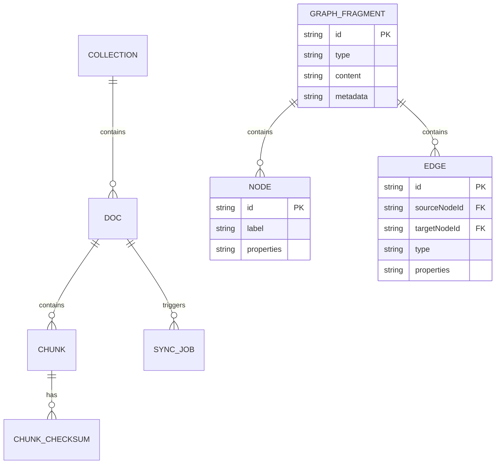

# 领域模型与数据映射

本文档详细描述了系统的核心领域对象、它们之间的关系，以及它们如何映射到持久化存储（SQLite 和 Qdrant）。

## 1. 核心领域对象

系统围绕以下核心领域对象组织数据：

- `Collection`：文档的逻辑分组。
- `Doc`：单个文档，包含原始内容和元数据。
- `Chunk`：文档分割后的文本块，带有向量和元数据。
- `GraphFragment`：包含 `Node` 与 `Edge`，用于表示知识图谱中的实体和关系。
- `RetrievalResult`：联合类型，支持多种检索结果（如 `chunkResult`、`graphResult` 等）。
- `SyncJob`：记录向量同步任务的状态，用于确保 Qdrant 与 SQLite 的最终一致性。
- `ChunkChecksum`：用于 `AutoGC` 模块追踪 `Chunk` 数据的快照，辅助双端比对。

### 1.1 实体关系图

**说明**：

- `Collection` 包含多个 `Doc`。
- `Doc` 包含多个 `Chunk`。
- `Doc` 的处理会触发 `SyncJob`。
- 每个 `Chunk` 都会有对应的 `ChunkChecksum` 记录。
- `GraphFragment` 是知识图谱的基本单元，包含 `Node` 和 `Edge`。

### 1.2 领域对象字段语义表

#### Collection

| 字段名        | 类型     | 描述           | 备注           |
| :------------ | :------- | :------------- | :------------- |
| `id`          | `string` | 唯一标识符     | UUID           |
| `name`        | `string` | 集合名称       |                |
| `description` | `string` | 集合描述       | 可选           |
| `createdAt`   | `number` | 创建时间戳     | Unix timestamp |
| `updatedAt`   | `number` | 最后更新时间戳 | Unix timestamp |

#### Doc

| 字段名         | 类型      | 描述             | 备注               |
| :------------- | :-------- | :--------------- | :----------------- |
| `id`           | `string`  | 唯一标识符       | UUID，基于内容哈希 |
| `collectionId` | `string`  | 所属集合 ID      | 外键               |
| `name`         | `string`  | 文档名称         |                    |
| `mimeType`     | `string`  | 文档 MIME 类型   |                    |
| `sizeBytes`    | `number`  | 文档大小（字节） |                    |
| `contentHash`  | `string`  | 文档内容的哈希值 | SHA256             |
| `createdAt`    | `number`  | 创建时间戳       | Unix timestamp     |
| `updatedAt`    | `number`  | 最后更新时间戳   | Unix timestamp     |
| `isDeleted`    | `boolean` | 是否已软删除     |                    |

#### Chunk

| 字段名         | 类型     | 描述                 | 备注               |
| :------------- | :------- | :------------------- | :----------------- |
| `pointId`      | `string` | 向量点 ID            | `docId#chunkIndex` |
| `docId`        | `string` | 所属文档 ID          | 外键               |
| `collectionId` | `string` | 所属集合 ID          | 外键               |
| `chunkIndex`   | `number` | 文本块在文档中的索引 |                    |
| `titleChain`   | `string` | 文本块的标题链       |                    |
| `content`      | `string` | 文本块原始内容       |                    |
| `contentHash`  | `string` | 文本块内容的哈希值   | SHA256             |
| `createdAt`    | `number` | 创建时间戳           | Unix timestamp     |

#### GraphFragment

| 字段名     | 类型     | 描述         | 备注                   |
| :--------- | :------- | :----------- | :--------------------- |
| `id`       | `string` | 唯一标识符   | UUID                   |
| `type`     | `string` | 片段类型     | 例如 "entity_relation" |
| `content`  | `string` | 原始文本片段 |                        |
| `metadata` | `object` | 额外元数据   | JSON 对象              |

#### Node

| 字段名       | 类型     | 描述       | 备注                          |
| :----------- | :------- | :--------- | :---------------------------- |
| `id`         | `string` | 唯一标识符 | UUID                          |
| `label`      | `string` | 节点标签   | 例如 "Person", "Organization" |
| `properties` | `object` | 节点属性   | JSON 对象                     |

#### Edge

| 字段名         | 类型     | 描述        | 备注                           |
| :------------- | :------- | :---------- | :----------------------------- |
| `id`           | `string` | 唯一标识符  | UUID                           |
| `sourceNodeId` | `string` | 源节点 ID   | 外键                           |
| `targetNodeId` | `string` | 目标节点 ID | 外键                           |
| `type`         | `string` | 边类型      | 例如 "WORKS_FOR", "LOCATED_IN" |
| `properties`   | `object` | 边属性      | JSON 对象                      |

#### RetrievalResult

`RetrievalResult` 是一个联合类型，可以表示 `ChunkResult` 或 `GraphResult`。

##### ChunkResult

| 字段名     | 类型     | 描述         | 备注                                        |
| :--------- | :------- | :----------- | :------------------------------------------ |
| `type`     | `string` | 结果类型     | `chunkResult`                               |
| `score`    | `number` | 检索分数     |                                             |
| `content`  | `string` | 文本块内容   |                                             |
| `metadata` | `object` | 文本块元数据 | 包含 `docId`, `chunkIndex`, `titleChain` 等 |

##### GraphResult

| 字段名          | 类型     | 描述           | 备注                 |
| :-------------- | :------- | :------------- | :------------------- |
| `type`          | `string` | 结果类型       | `graphResult`        |
| `score`         | `number` | 检索分数       |                      |
| `graphFragment` | `object` | 提取到的图片段 | `GraphFragment` 对象 |
| `metadata`      | `object` | 额外元数据     |                      |

#### SyncJob

| 字段名          | 类型     | 描述           | 备注                                                    |
| :-------------- | :------- | :------------- | :------------------------------------------------------ |
| `id`            | `string` | 唯一标识符     | UUID                                                    |
| `docId`         | `string` | 所属文档 ID    | 外键                                                    |
| `status`        | `string` | 同步任务状态   | NEW, SPLIT_OK, EMBED_OK, SYNCED, FAILED, RETRYING, DEAD |
| `retries`       | `number` | 重试次数       |                                                         |
| `lastAttemptAt` | `number` | 最后尝试时间戳 | Unix timestamp                                          |
| `error`         | `string` | 错误信息       | 可选                                                    |
| `createdAt`     | `number` | 创建时间戳     | Unix timestamp                                          |
| `updatedAt`     | `number` | 最后更新时间戳 | Unix timestamp                                          |

#### ChunkChecksum

| 字段名         | 类型     | 描述               | 备注                 |
| :------------- | :------- | :----------------- | :------------------- |
| `pointId`      | `string` | 向量点 ID          | `docId#chunkIndex`   |
| `docId`        | `string` | 所属文档 ID        | 外键                 |
| `collectionId` | `string` | 所属集合 ID        | 外键                 |
| `checksum`     | `string` | 文本块内容的校验和 | SHA256，用于双端比对 |
| `createdAt`    | `number` | 创建时间戳         | Unix timestamp       |
| `updatedAt`    | `number` | 最后更新时间戳     | Unix timestamp       |
