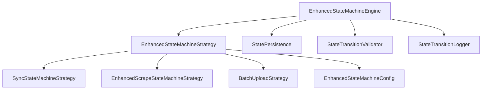

# 增强状态机框架

本文档详细描述了基于策略模式的增强状态机框架的设计、实现和使用方式。该框架提供了统一的状态管理、验证、日志记录和指标收集功能，支持多种类型的状态机策略。

## 1. 框架概览

增强状态机框架采用策略模式设计，将状态机的通用功能与具体业务逻辑分离。框架核心提供状态转换管理、验证、日志记录和指标收集，而具体策略实现业务特定的状态转换逻辑。

### 1.1 架构组件



### 1.2 核心特性

- **策略模式**：支持多种状态机策略的统一管理
- **状态转换验证**：内置验证机制，确保状态转换的合法性
- **详细日志记录**：记录所有状态转换的详细信息
- **指标收集**：自动收集执行时间、成功率等关键指标
- **错误处理**：统一的错误处理和重试机制
- **批量操作**：支持批量创建和执行任务

## 2. 状态定义

| 状态名     | 描述                                                |
| :--------- | :-------------------------------------------------- |
| `NEW`      | 新创建的同步任务，等待开始处理。                    |
| `SPLIT_OK` | 文档已成功切片，文本块已保存到 SQLite。             |
| `EMBED_OK` | 文本块已成功生成向量并插入到 Qdrant。               |
| `SYNCED`   | 元数据已更新，Qdrant 和 SQLite 数据已达到最终一致。 |
| `FAILED`   | 同步任务在某个阶段失败。                            |
| `RETRYING` | 同步任务失败后，正在尝试重试。                      |
| `DEAD`     | 同步任务重试次数超过上限，已永久失败。              |

## 3. 事件协议

状态机通过接收事件来驱动状态转移。

| 事件名              | 描述                                         | 触发条件                                                                      |
| :------------------ | :------------------------------------------- | :---------------------------------------------------------------------------- |
| `chunksSaved()`     | 文本块成功保存到 SQLite。                    | `ImportService` 在完成文本切片和 SQLite 写入后触发。                          |
| `vectorsInserted()` | 向量成功插入到 Qdrant。                      | `ImportService` 在完成向量生成和 Qdrant 写入后触发。                          |
| `metaUpdated()`     | 元数据成功更新，表示同步完成。               | `ImportService` 在所有数据入库并更新元数据后触发。                            |
| `error()`           | 在 `SPLIT_OK` 或 `EMBED_OK` 状态下发生错误。 | 任何处理步骤中发生异常时触发。                                                |
| `retry()`           | 触发重试机制。                               | `SyncStateMachine` 的异步轮询任务检测到 `FAILED` 状态且未超过重试上限时触发。 |
| `retriesExceeded()` | 重试次数超过上限。                           | `SyncStateMachine` 的异步轮询任务检测到 `FAILED` 状态且已超过重试上限时触发。 |

## 4. 实现方式

- **技术栈**：借助 `xstate` 库定义状态转移逻辑，提供强大的状态管理能力。
- **持久化**：同步任务的状态持久化在 SQLite 数据库的 `sync_jobs` 数据表中。
- **异步任务**：通过一个后台异步任务轮询 `sync_jobs` 表，检测处于 `NEW`、`FAILED` 或 `RETRYING` 状态的任务，并根据其当前状态和业务逻辑驱动状态演进。

## 5. 重试策略

当同步任务进入 `FAILED` 状态时，系统会根据预设的重试策略进行重试。

- **重试次数**：每个同步任务允许的最大重试次数。
- **重试间隔**：重试之间的等待时间，可以采用指数退避策略。
- **失败处理**：如果重试次数超过上限，任务将进入 `DEAD` 状态，需要人工介入处理。


## 6. 核心接口

### 6.1 增强状态机引擎接口

```typescript
interface IEnhancedStateMachineEngine {
  registerStrategy(strategy: EnhancedStateMachineStrategy): void;
  getStrategy(taskType: string): EnhancedStateMachineStrategy | null;
  createTask(taskType: string, taskId: string, initialContext?: Record<string, unknown>): Promise<StateMachineTask>;
  transitionState(taskId: string, event: string, context?: Record<string, unknown>): Promise<boolean>;
  validateTransition(taskId: string, event: string, context?: Record<string, unknown>): Promise<StateTransitionValidationResult>;
  executeTask(taskId: string): Promise<void>;
  getTask(taskId: string): Promise<StateMachineTask | null>;
  getTasksByStatus(status: string): Promise<StateMachineTask[]>;
  getTasksByType(taskType: string): Promise<StateMachineTask[]>;
  getTransitionHistory(taskId: string, limit?: number): Promise<StateTransitionLog[]>;
  getGlobalMetrics(): Promise<StateMachineMetrics>;
  getStrategyMetrics(taskType: string): Promise<StateMachineMetrics>;
  // ... 其他方法
}
```

### 6.2 增强状态机策略接口

```typescript
interface EnhancedStateMachineStrategy {
  readonly strategyId: string;
  readonly config: EnhancedStateMachineConfig;
  handleTransition(taskId: string, event: string, context?: Record<string, unknown>): Promise<boolean>;
  validateTransition(taskId: string, event: string, context?: Record<string, unknown>): Promise<StateTransitionValidationResult>;
  getCurrentState(taskId: string): Promise<string | null>;
  createTask(taskId: string, initialContext?: Record<string, unknown>): Promise<StateMachineTask>;
  executeTask(taskId: string): Promise<void>;
  handleError(taskId: string, error: Error): Promise<void>;
  getTransitionHistory(taskId: string, limit?: number): Promise<StateTransitionLog[]>;
  getTaskMetrics(): Promise<StateMachineMetrics>;
}
```

## 7. 状态转换验证

### 7.1 验证器接口

```typescript
interface StateTransitionValidator {
  validateTransition(
    fromState: string,
    toState: string,
    event: string,
    context?: Record<string, unknown>
  ): Promise<StateTransitionValidationResult>;
}
```

### 7.2 验证结果

```typescript
interface StateTransitionValidationResult {
  valid: boolean;
  error?: string;
  warnings?: string[];
}
```

### 7.3 默认验证器

框架提供了 `DefaultStateTransitionValidator` 实现，包含基础验证逻辑：
- 参数完整性检查
- 状态转换合法性检查
- 上下文信息验证

## 8. 状态转换日志

### 8.1 日志记录器接口

```typescript
interface StateTransitionLogger {
  logTransition(log: StateTransitionLog): Promise<void>;
  getTransitionHistory(taskId: string, limit?: number): Promise<StateTransitionLog[]>;
  cleanupExpiredLogs(olderThan: number): Promise<number>;
}
```

### 8.2 日志条目结构

```typescript
interface StateTransitionLog {
  id: string;
  taskId: string;
  fromState: string;
  toState: string;
  event: string;
  timestamp: number;
  success: boolean;
  error?: string;
  context?: Record<string, unknown>;
  duration?: number;
}
```

## 9. 指标收集

### 9.1 指标结构

```typescript
interface StateMachineMetrics {
  totalTasks: number;
  tasksByState: Record<string, number>;
  tasksByType: Record<string, number>;
  averageExecutionTime: number;
  successRate: number;
  failureRate: number;
  retryRate: number;
}
```

### 9.2 指标收集

框架自动收集以下指标：
- 任务总数和分布
- 执行时间统计
- 成功率和失败率
- 重试率统计

## 10. 具体策略实现

### 10.1 同步状态机策略

```typescript
class SyncStateMachineStrategy extends EnhancedBaseStateMachineStrategy {
  constructor(
    sqliteRepo: ISQLiteRepo,
    qdrantRepo: IQdrantRepo,
    embeddingProvider: IEmbeddingProvider,
    splitter: ISplitter,
    persistence: StatePersistence,
    logger: Logger,
  );
  
  async executeTask(taskId: string): Promise<void>;
  async createSyncTask(docId: DocId): Promise<string>;
  async getSyncTaskStatus(docId: DocId): Promise<SyncJob | null>;
  // ... 其他方法
}
```

### 10.2 爬虫状态机策略

```typescript
class EnhancedScrapeStateMachineStrategy extends EnhancedBaseStateMachineStrategy {
  constructor(
    webCrawler: IWebCrawler,
    contentExtractor: IContentExtractor,
    sqliteRepo: ISQLiteRepo,
    persistence: StatePersistence,
    logger: Logger,
  );
  
  async executeTask(taskId: string): Promise<void>;
  async createScrapeTask(config: ScrapeConfig): Promise<string>;
  async getScrapeTask(taskId: string): Promise<IScrapeTask | null>;
  // ... 其他方法
}
```

## 11. 使用方式

### 11.1 创建增强状态机服务

```typescript
const enhancedStateMachineService = new EnhancedStateMachineService(
  logger,
  sqliteRepo,
  qdrantRepo,
  embeddingProvider,
  splitter,
  webCrawler,
  contentExtractor
);
```

### 11.2 触发文档同步

```typescript
await enhancedStateMachineService.triggerSync(docId);
```

### 11.3 创建爬虫任务

```typescript
const taskId = await enhancedStateMachineService.createScrapeTask({
  url: 'https://example.com',
  selector: '.content',
  maxDepth: 2
});
```

### 11.4 获取任务指标

```typescript
const globalMetrics = await enhancedStateMachineService.getGlobalMetrics();
const syncMetrics = await enhancedStateMachineService.getStrategyMetrics('document_sync');
```

## 12. 重试策略

### 12.1 重试机制

框架提供了统一的重试机制：
- 最大重试次数配置
- 指数退避策略
- 重试条件验证
- 死亡状态处理

### 12.2 重试配置

```typescript
interface EnhancedStateMachineConfig {
  maxRetries?: number;
  // ... 其他配置
}
```

## 13. 测试

框架提供了全面的单元测试覆盖：
- 状态机引擎测试
- 策略实现测试
- 状态转换验证测试
- 错误处理测试
- 指标收集测试

## 14. 迁移指南

### 14.1 从原有状态机迁移

1. 创建新的策略实现，继承 `EnhancedBaseStateMachineStrategy`
2. 定义状态转换配置
3. 实现业务特定的执行逻辑
4. 注册策略到增强状态机引擎

### 14.2 兼容性

新框架保持与现有API的兼容性，可以逐步迁移现有状态机实现。