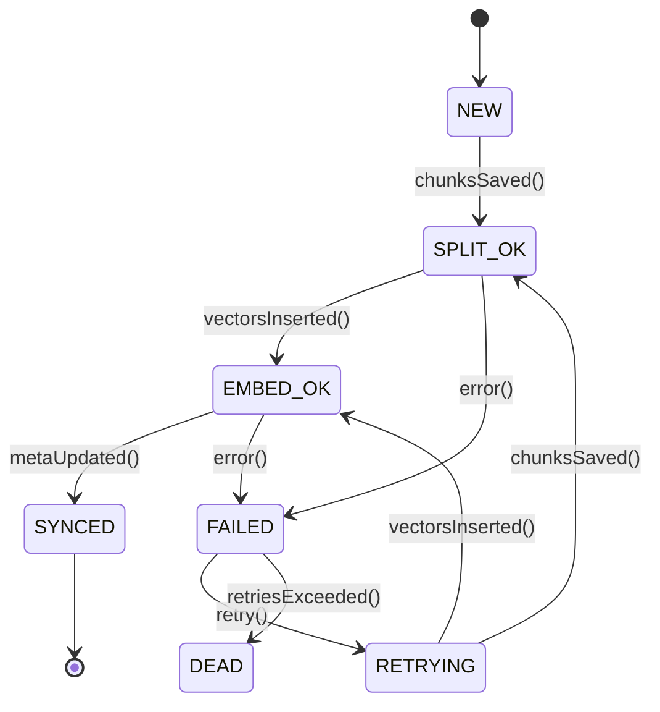

# 向量同步状态机

本文档详细描述了向量同步状态机（Sync StateMachine）的设计、状态转移逻辑、事件协议以及重试策略。该状态机旨在确保 Qdrant 向量数据库与 SQLite 元数据存储之间的数据最终一致性。

## 1. 状态机概览

向量同步状态机负责管理文档从导入到向量化、入库的整个生命周期。每个文档或批次都会有一个对应的同步任务，其状态由状态机驱动。

## 2. 状态定义

| 状态名        | 描述                                                         |
| :------------ | :----------------------------------------------------------- |
| `NEW`         | 新创建的同步任务，等待开始处理。                             |
| `SPLIT_OK`    | 文档已成功切片，文本块已保存到 SQLite。                      |
| `EMBED_OK`    | 文本块已成功生成向量并插入到 Qdrant。                        |
| `SYNCED`      | 元数据已更新，Qdrant 和 SQLite 数据已达到最终一致。          |
| `FAILED`      | 同步任务在某个阶段失败。                                     |
| `RETRYING`    | 同步任务失败后，正在尝试重试。                               |
| `DEAD`        | 同步任务重试次数超过上限，已永久失败。                       |

## 3. 事件协议

状态机通过接收事件来驱动状态转移。

| 事件名            | 描述                                                         | 触发条件                                                     |
| :---------------- | :----------------------------------------------------------- | :----------------------------------------------------------- |
| `chunksSaved()`   | 文本块成功保存到 SQLite。                                    | `ImportService` 在完成文本切片和 SQLite 写入后触发。         |
| `vectorsInserted()`| 向量成功插入到 Qdrant。                                      | `ImportService` 在完成向量生成和 Qdrant 写入后触发。         |
| `metaUpdated()`   | 元数据成功更新，表示同步完成。                               | `ImportService` 在所有数据入库并更新元数据后触发。           |
| `error()`         | 在 `SPLIT_OK` 或 `EMBED_OK` 状态下发生错误。                 | 任何处理步骤中发生异常时触发。                               |
| `retry()`         | 触发重试机制。                                               | `SyncStateMachine` 的异步轮询任务检测到 `FAILED` 状态且未超过重试上限时触发。 |
| `retriesExceeded()`| 重试次数超过上限。                                           | `SyncStateMachine` 的异步轮询任务检测到 `FAILED` 状态且已超过重试上限时触发。 |

## 4. 实现方式

*   **技术栈**：借助 `xstate` 库定义状态转移逻辑，提供强大的状态管理能力。
*   **持久化**：同步任务的状态持久化在 SQLite 数据库的 `sync_jobs` 数据表中。
*   **异步任务**：通过一个后台异步任务轮询 `sync_jobs` 表，检测处于 `NEW`、`FAILED` 或 `RETRYING` 状态的任务，并根据其当前状态和业务逻辑驱动状态演进。

## 5. 重试策略

当同步任务进入 `FAILED` 状态时，系统会根据预设的重试策略进行重试。

*   **重试次数**：每个同步任务允许的最大重试次数。
*   **重试间隔**：重试之间的等待时间，可以采用指数退避策略。
*   **失败处理**：如果重试次数超过上限，任务将进入 `DEAD` 状态，需要人工介入处理。